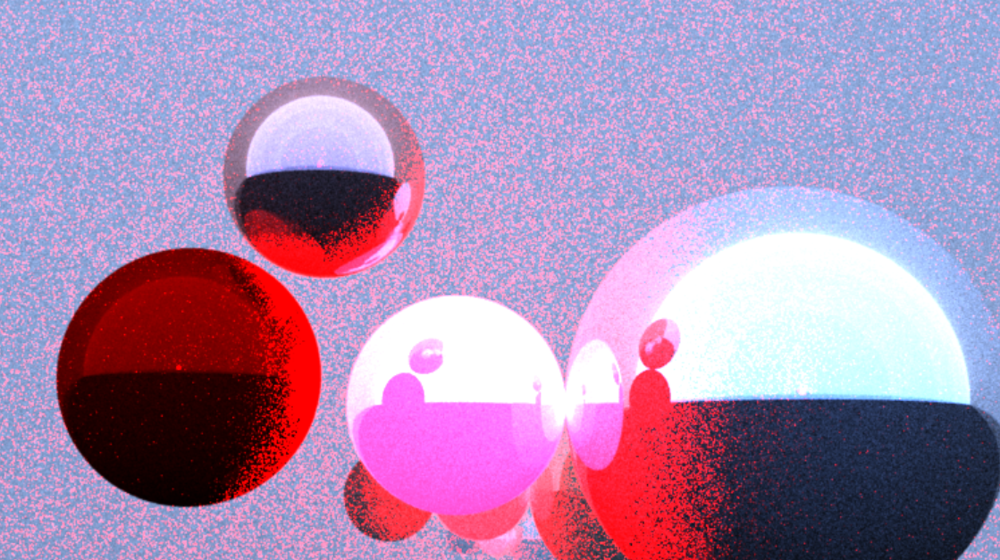
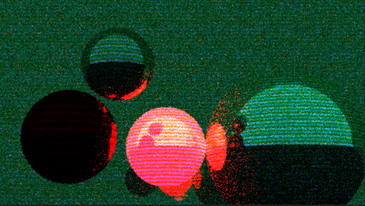
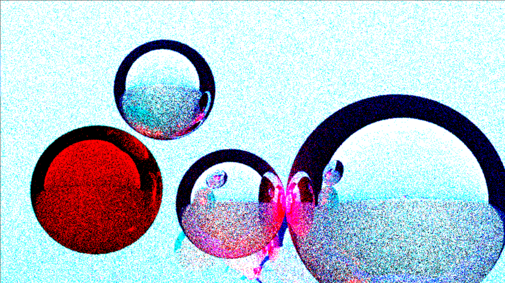

# StylisedRendering

A physically based stylised non-photorealistic renderer programmed with Julia. Based on a [2024 SIGGRAPH paper](http://cv.rexwe.st/pdf/srfoe.pdf). A function of expectation is used to produce stylizations like the renderings below.  





## Implementation
The user needs to make a camera using the `makeCamera` function, create a scene objects and put them into a scene using the union operator(`\cup` or `\bigcup`), then ray trace the scene with the `render` function.

```Julia
# Create camera
cameraPosition = PointVector(0.02,-0.04,-0.07)
camera = makeCamera(cameraPosition)

# Create primitives and assign material and stylization properties
light = Object(Plane(PointVector(0,-1,0), ĵ), 
               genericEmissiveMaterial([0.3,0.5,1], 1.6), # Blue light
               STYLE_identity)
floor = Object(Plane(PointVector(0, 0, -0.1), k̂), 
               MATERIAL_pianoLacquer, 
               STYLE_identity)
wall_front = Object(Plane(PointVector(0, 1, 0), ĵ),
                    MATERIAL_softBeigeLeather, 
                    STYLE_identity)

ball = Object(Sphere(PointVector(-0.1,0.5,0.0), 0.05),
              MATERIAL_coatedMetalPaint, 
              STYLE_identity * STYLE_fill([0.61,0.92,0.63])) # green tint
ball2 = Object(Sphere(PointVector(-0.05,0.5,0.08), 0.04), 
               MATERIAL_copper, 
               STYLE_edgeLines(0.2, [0,0,0]) ∘ STYLE_identity)
ball3 = Object(Sphere(PointVector(0,0.6,0), 0.05), 
               genericEmissiveMaterial([1,0.3,0.8], 100), # bright pink light
               STYLE_identity) 
ball4 = Object(Sphere(PointVector(0.15,0.6,0), 0.1), 
               MATERIAL_silver, 
               STYLE_invert)

# Scene set up
lightsource = DirectionVector(1,1,1) # THIS IS REDUNDANT IN CURRENT VERSION
room = ⋃(light, floor, wall_front)
props = ⋃(ball, ball2, ball3, ball4)
𝕊 = room ∪ props # type `\bbS + TAB` for double struck S

# Ray trace the scene
sampleCount = 2
depth = 3
image = render(camera, 𝕊, lightsource, sampleCount, depth)

# View rendering
colorview(RGB, image)
```

This program is written in Julia such that computations read off like mathematical equations. It is therefore not optimized for performance. The user is advised against creating scenes containing many surfaces, making too many triangles, making animations, rendering with high sample counts and high depth.

Stylization functions form a ring. The user can thus create new styles by operating on elementary stylization functions for example:
```
STYLE_new = STYLE_edgeLines(0.2, BLACK) ∘ (0.1STYLE_identity + 0.9STYLE_invert) ∘ (STYLE_stripes([0.1, 0.5, 0.9], [BROWN, GOLD, CRIMSONRED, ALGAEGREEN]) * STYLE_identity)
```
To use the composition operator ∘, just type `\circ + TAB` in Julia.


### Coming next
- A guide for ray tracing in $n$-dimensions
- Julian refactors
- More styles
- Triangular mesh

### Missing features
- Transparent materials, refraction and dispersion
- Variance reduction
- Acceleration structures
- More stylization parameters e.g. path prefix, time, camera settings, previous frames' data, speed and acceleration
- Evanescent waves